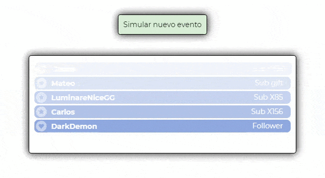

# SE.widget.lastevents
Widget for StreamElements.  Displays last events and set an opacity for old events.

---

---

In `public` folder there is the widget.  in `src` folder there is the code to test and develop the widget.
